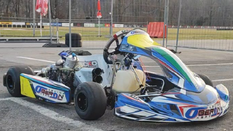

### Welcome to my showcase page (work in progress)

I'm a **data specialist**, but a bit of a generalist, in love with **motorsports** and **technology**. Always willing to learn and expand my horizons.

This is a more spontaneous introduction. I will leave the cut throat elevator pitch stuff for the CV. Just know that I like to find solutions, and most of the times I succeed. I dive into things, learn fast and try to deliver quality work.

I was not an academic phenomenon (by any means), but I was always curious and committed to learn what I really like. And I've always loved computers and machines. So at later stages, after I was certain my childhood dreams of being a world class racing driver were dead and buried, I've understood what my direction could be, and step by step, line of code after line of code, automation after automation, here we are.

I have moved around, and worked in and lived in 4 countries and 2 continents and in different industries, which gave me some business acumen, and a million viewing angles on the corporate world in different cultural setups.
I'm glad I had the chance to do this (thinking where the world is going as I write). My life wasn't boring at all so far, and along the way I have made good friends around the world.

Lately my lifetime passion came back almost violently, when I have "wisely" decided, at the dawn of my 42nd year of age and with the second child on the way, to buy the most basic racing machine, but in it's most brutal format: a 50hp shifter kart, capable of launching you from 0 to 100 in less than 3 seconds, and that can break your ribs after 2 corners if you don't do things right.

Yes. That's me. If i really like something, it's all or nothing. And boy what a journey so far...
Now my son got into it too. So I bought him a mini, and we enjoy trackdays together. Those are beautiful days and will be precious memories. He wants to be a racing driver too, so I will be helping him on this, and do whatever I can to avoid his dreams are shattered like mine, even if in 6 months from now he wants to switch to tennis or whatever.

I also like to lift weights, and although I'm completely absorbed into work, reading a good book (or listening to the audio version of it) is always something i enjoy, and I have read a few. I quite enjoy soccer (my body says otherwise lately) and whenever I can, I play even with my son at the park.
Music wise, I listen to everything, as long as it's tasteful.

So you, hey you recruiting. He seems to be a good professional and a nice guy...

Besides work, if you want to connect, I'm always happily available to find like minded good souls that have some common sense in their brain and have a chat.
