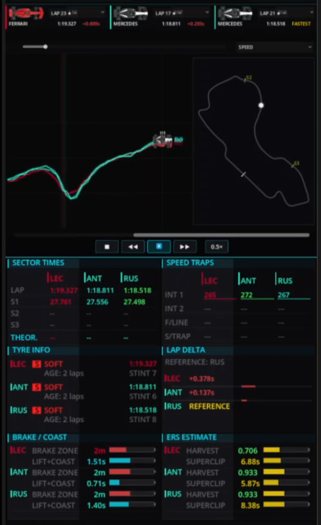
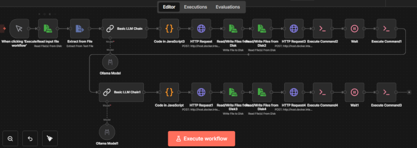
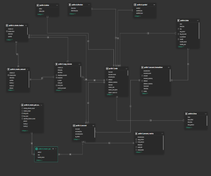
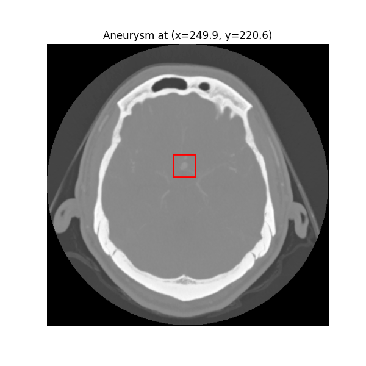
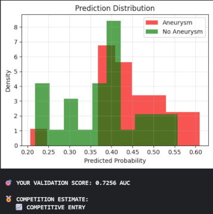
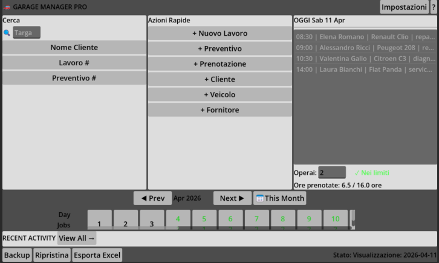
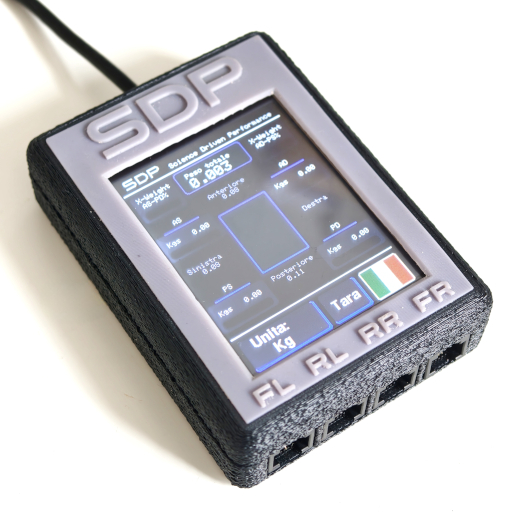

## My work 

___

### Corporate work
Details on my CV

[Download my text only CV HERE](/assets/docs/cv_text.pdf)

[Download my visual CV HERE](/assets/docs/cv_visuals.pdf)

---

### Personal projects work
---
**Formula 1 telemetry app** - An app written in Python fetching telemetry data via the fastf1 API, using Godot as graphics engine, to display beautiful animations of every lap of any session of every GP of the F1 seasons, allowing to compare insightful and rich datapoints for up to 3 drivers at a time. Still under development.

---

### **Automatic short video generator** - [Example video](https://www.instagram.com/p/DXetp9ziJ0N/)
_An 100% local n8n workflow that uses Ollama and ffmpeg to automatically generate a short 30 seconds slideshow with dissolvence, watermark logo, and a summary voiceover with subtitles of any text you paste in an input file_

---

### **Complete data infrastructure**
_A complete data infrastructure for data analysis and violations detections for a Prop trading firm. Written in python, it fetches data from API calls and organizes everything in a star schema datawarehouse in PostgreSQL, then fed to PowerBI for visual analysis_

---

### **Brain aneurysm detection model**
_A model I have trained for a Kaggle competition, on sample data supplied by the competition website, plus augmented and external data i have produced and fetched. Late for the entry but evaluated the score with the competition official formula, would have placed 42nd on top of 1140 entries_

 

---

### **Garage manager pro**
_A local CRM for small/medium auto repair shops, based on Godot and SQLite. Born from a friends need. Under development and to be for sale soon_

---

### **Electronic devices and products**
_As a sidequest I'm trying to launch a brand about motorsports called SDP (Science Driven Perormance) for which i have fully engineered a go kart scale that has a touchscreen and connects to the 4 plates under the wheels. It gives full weight distribution in all corner, real time COG and cross weight. The menu switches between 4 languages and imperial and metric units. the products pipeline also has a reaction training device with 6 pads (currently under development) and a full telemetry system_

